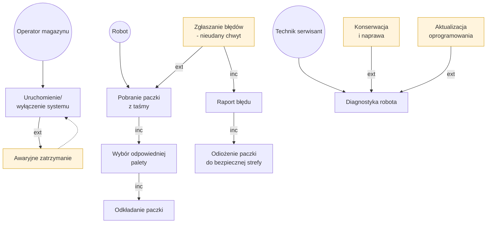
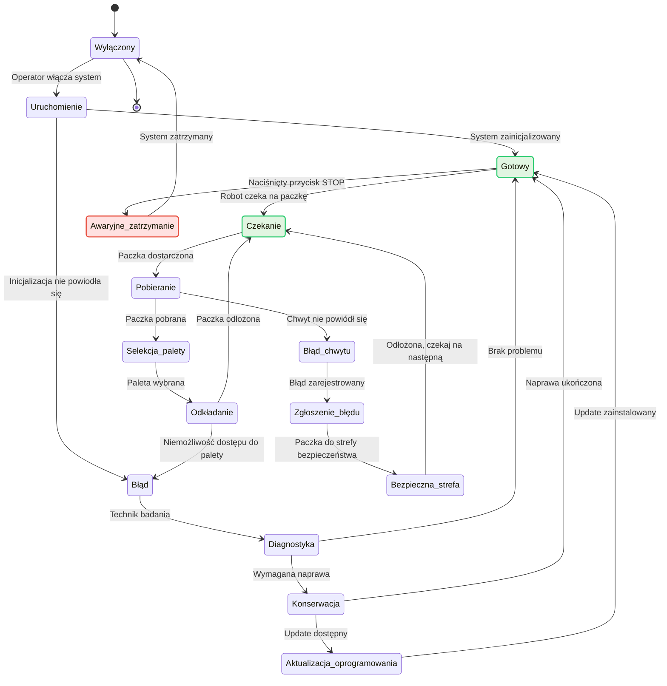

# robot przemysłowy

### Schemat blokowy systemu (Flowchart)

```mermaid
graph TD
    %% Aktorzy
    Operator((Operator magazynu))
    RobotAct((Robot))
    Technik((Technik serwisant))

    %% Procesy Operatora
    Operator --> UC1[Uruchomienie/<br/>wyłączenie systemu]
    UC1 -->|ext| UC2[Awaryjne zatrzymanie]
    UC2 -.-> UC1

    %% Procesy Robota
    RobotAct --> UC5[Pobranie paczki<br/>z taśmy]
    UC5 -->|inc| UC6[Wybór odpowiedniej<br/>palety]
    UC6 -->|inc| UC3[Odkładanie paczki]

    UC7[Zgłaszanie błędów<br/>- nieudany chwyt] -->|ext| UC5
    UC7 -->|inc| UC8[Raport błędu]
    UC8 -->|inc| UC4[Odiożenie paczki<br/>do bezpiecznej strefy]

    %% Procesy Technika
    Technik --> UC9[Diagnostyka robota]
    UC10[Konserwacja<br/>i naprawa] -->|ext| UC9
    UC11[Aktualizacja<br/>oprogramowania] -->|ext| UC9

    %% Stylizacja dla czytelności
    style UC2 fill:#fff4dd,stroke:#d4a017
    style UC7 fill:#fff4dd,stroke:#d4a017
    style UC10 fill:#fff4dd,stroke:#d4a017
    style UC11 fill:#fff4dd,stroke:#d4a017
```

### Diagram stanów systemu (State Diagram)

```mermaid
stateDiagram-v2
    [*] --> Wyłączony
    
    Wyłączony --> Uruchomienie: Operator włącza system
    
    Uruchomienie --> Gotowy: System zainicjalizowany
    Uruchomienie --> Błąd: Inicjalizacja nie powiodła się
    
    Gotowy --> Czekanie: Robot czeka na paczkę
    Gotowy --> Awaryjne_zatrzymanie: Naciśnięty przycisk STOP
    
    Czekanie --> Pobieranie: Paczka dostarczona
    
    Pobieranie --> Selekcja_palety: Paczka pobrana
    Pobieranie --> Błąd_chwytu: Chwyt nie powiódł się
    
    Selekcja_palety --> Odkładanie: Paleta wybrana
    
    Odkładanie --> Czekanie: Paczka odłożona
    Odkładanie --> Błąd: Niemożliwość dostępu do palety
    
    Błąd_chwytu --> Zgłoszenie_błędu: Błąd zarejestrowany
    Zgłoszenie_błędu --> Bezpieczna_strefa: Paczka do strefy bezpieczeństwa
    Bezpieczna_strefa --> Czekanie: Odłożona, czekaj na następną
    
    Błąd --> Diagnostyka: Technik badania
    
    Diagnostyka --> Konserwacja: Wymagana naprawa
    Diagnostyka --> Gotowy: Brak problemu
    
    Konserwacja --> Aktualizacja_oprogramowania: Update dostępny
    Konserwacja --> Gotowy: Naprawa ukończona
    
    Aktualizacja_oprogramowania --> Gotowy: Update zainstalowany
    
    Awaryjne_zatrzymanie --> Wyłączony: System zatrzymany
    
    Wyłączony --> [*]
    
    %% Stylizacja
    classDef error fill:#fff4dd,stroke:#d4a017,stroke-width:2px
    classDef normal fill:#e1f5e1,stroke:#2ecc71,stroke-width:2px
    classDef warning fill:#ffe1e1,stroke:#e74c3c,stroke-width:2px
    
    class Błąd error
    class Błąd_chwytu error
    class Awaryjne_zatrzymanie warning
    class Gotowy normal
    class Czekanie normal
    class Odkładanie normal
```
