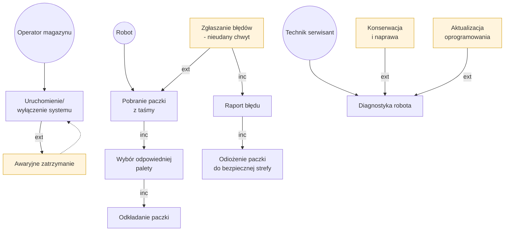

# robot przemysłowy

### Schemat blokowy systemu (Flowchart)

```mermaid
graph TD
    %% Aktorzy
    Operator((Operator magazynu))
    RobotAct((Robot))
    Technik((Technik serwisant))

    %% Procesy Operatora
    Operator --> UC1[Uruchomienie/<br/>wyłączenie systemu]
    UC1 -->|ext| UC2[Awaryjne zatrzymanie]
    UC2 -.-> UC1

    %% Procesy Robota
    RobotAct --> UC5[Pobranie paczki<br/>z taśmy]
    UC5 -->|inc| UC6[Wybór odpowiedniej<br/>palety]
    UC6 -->|inc| UC3[Odkładanie paczki]

    UC7[Zgłaszanie błędów<br/>- nieudany chwyt] -->|ext| UC5
    UC7 -->|inc| UC8[Raport błędu]
    UC8 -->|inc| UC4[Odiożenie paczki<br/>do bezpiecznej strefy]

    %% Procesy Technika
    Technik --> UC9[Diagnostyka robota]
    UC10[Konserwacja<br/>i naprawa] -->|ext| UC9
    UC11[Aktualizacja<br/>oprogramowania] -->|ext| UC9

    %% Stylizacja dla czytelności
    style UC2 fill:#fff4dd,stroke:#d4a017
    style UC7 fill:#fff4dd,stroke:#d4a017
    style UC10 fill:#fff4dd,stroke:#d4a017
    style UC11 fill:#fff4dd,stroke:#d4a017
```
