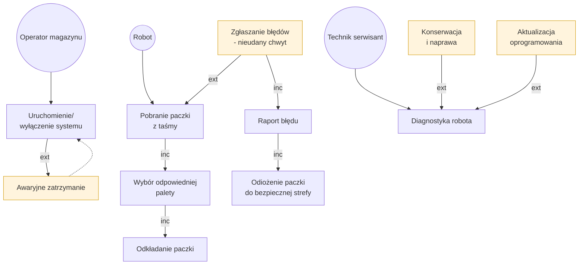
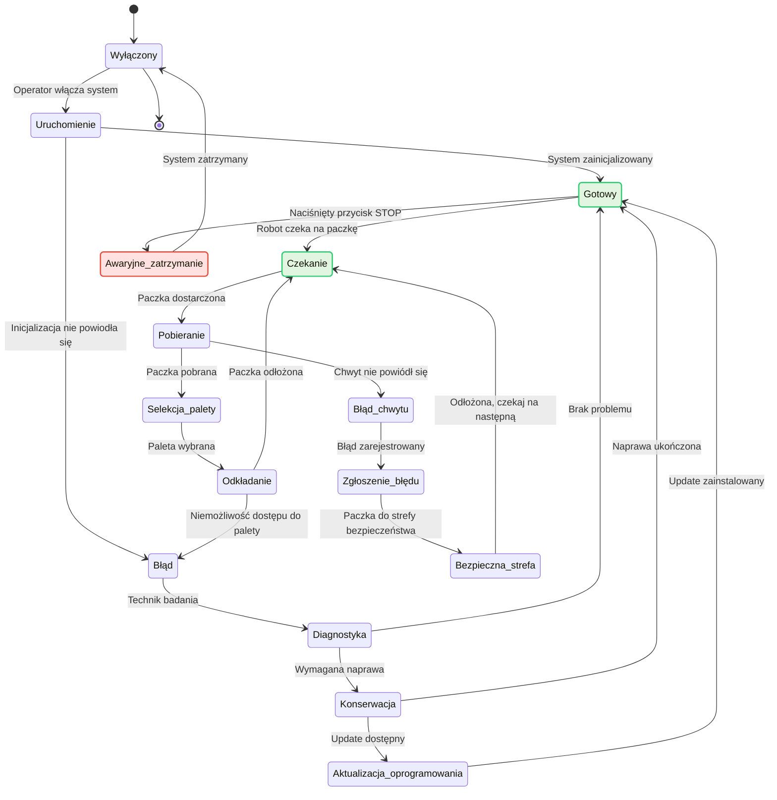
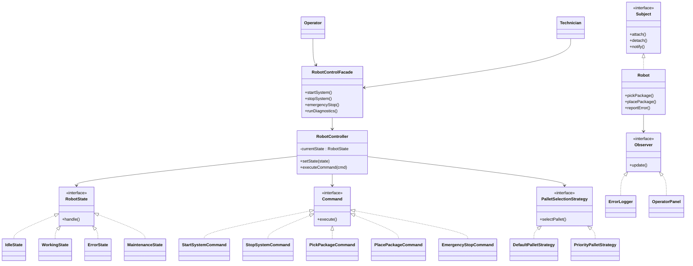

# robot przemysłowy

### Schemat blokowy systemu (Flowchart)

### Diagram stanów systemu (State Diagram)

# Analiza zastosowanych wzorców projektowych

## Zastosowane wzorce projektowe

### State (Stan)
**Cel wzorca:**  
Umożliwia zmianę zachowania obiektu w zależności od jego aktualnego stanu, bez stosowania rozbudowanych instrukcji warunkowych.

**Zastosowanie w systemie:**  
Robot magazynowy może znajdować się w kilku stanach, takich jak: bezczynność, praca, błąd oraz tryb serwisowy. Każdy stan definiuje własne zachowanie robota oraz reakcję na polecenia operatora i zdarzenia awaryjne.

**Korzyści:**  
- czytelna logika sterowania,
- łatwe dodawanie nowych stanów,
- ograniczenie złożoności kodu.

---

### Command (Polecenie)
**Cel wzorca:**  
Hermetyzuje żądanie jako obiekt, co umożliwia parametryzację, kolejkowanie oraz logowanie poleceń.

**Zastosowanie w systemie:**  
Polecenia takie jak uruchomienie systemu, pobranie paczki, odkładanie paczki czy awaryjne zatrzymanie są realizowane jako osobne obiekty typu Command.

**Korzyści:**  
- rozdzielenie nadawcy polecenia od wykonawcy,
- łatwe testowanie i rozbudowa systemu,
- możliwość rejestrowania operacji.

---

### Observer (Obserwator)
**Cel wzorca:**  
Zapewnia automatyczne powiadamianie wielu obiektów o zmianach stanu innego obiektu.

**Zastosowanie w systemie:**  
Robot powiadamia zarejestrowanych obserwatorów o wystąpieniu błędów, nieudanym chwycie lub zdarzeniach awaryjnych. Obserwatorami są m.in. panel operatora oraz moduł logowania błędów.

**Korzyści:**  
- luźne powiązania pomiędzy komponentami,
- łatwe dodawanie nowych modułów monitorujących,
- dobra skalowalność.

---

### Strategy (Strategia)
**Cel wzorca:**  
Umożliwia dynamiczną zmianę algorytmu działania bez ingerencji w kod klienta.

**Zastosowanie w systemie:**  
Strategie są wykorzystywane m.in. do wyboru palety lub sposobu obsługi wyjątków, w zależności od sytuacji operacyjnej.

**Korzyści:**  
- elastyczność systemu,
- możliwość łatwej modyfikacji algorytmów,
- poprawa czytelności kodu.

---

### Facade (Fasada)
**Cel wzorca:**  
Upraszcza dostęp do złożonego systemu poprzez jeden spójny interfejs.

**Zastosowanie w systemie:**  
Operator oraz technik korzystają z jednego interfejsu sterującego, który ukrywa szczegóły implementacyjne systemu robota.

**Korzyści:**  
- prostsze i bezpieczniejsze API,
- mniejsze ryzyko błędnego użycia systemu,
- lepsza separacja odpowiedzialności.

---

## Wzorce projektowe, które nie pasują do systemu

### Builder (Budowniczy)
**Dlaczego nie pasuje:**  
Wzorzec Builder służy do tworzenia złożonych obiektów krok po kroku. W analizowanym systemie nie występuje potrzeba konstruowania obiektów o skomplikowanej strukturze — kluczowa jest logika sterowania, a nie proces budowy obiektów.

---

### Abstract Factory (Abstrakcyjna fabryka)
**Dlaczego nie pasuje:**  
Wzorzec ten jest używany do tworzenia rodzin powiązanych obiektów. System robota nie wymaga dynamicznej wymiany całych rodzin komponentów, dlatego zastosowanie tego wzorca byłoby nieuzasadnione i nadmiernie skomplikowałoby architekturę.

---

## Podsumowanie
Zastosowane wzorce projektowe wspierają modularność, elastyczność oraz bezpieczeństwo sterowania robotem magazynowym. System koncentruje się na zarządzaniu zachowaniem i reakcją na zdarzenia, dlatego wzorce konstrukcyjne nie znajdują w nim praktycznego zastosowania.
``

### Diagram klas UML

